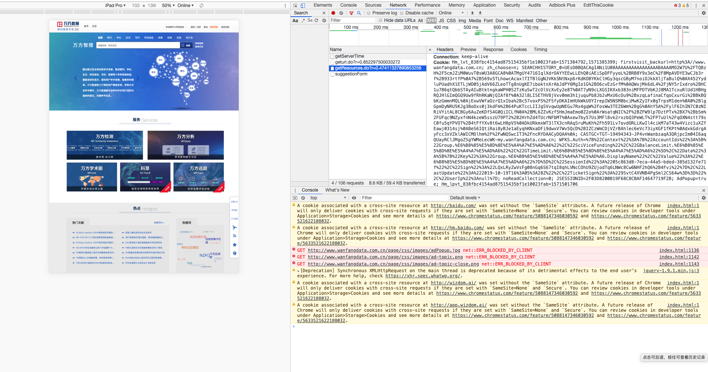
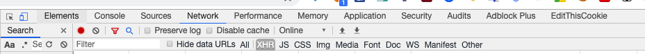
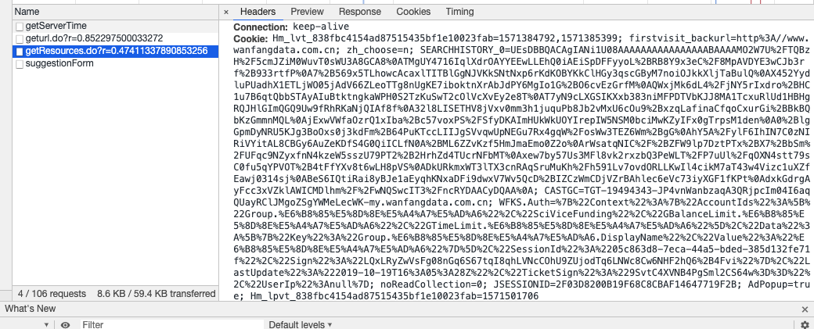

# CNKISpider

其实爬的是万方🐶

CNKI爬虫
```shell
python cnki.py --help
```

## Cookie更新教程

用Chrome进入http://www.wanfangdata.com.cn/searchResult/getCoreSearch.do

右键检查


进入如下页面



点击Network



刷新一下后右侧会出现如下页面



复制右侧Header栏下的Cookie项到./cookie.txt里

> 图中Cookie后面的Hm ....... 06那部分

然后开心地爬取摘要数据吧～