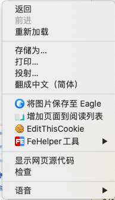

# CNKISpider

其实爬的是万方🐶

CNKI爬虫

## 运行

```shell
python cnki.py
```

## 查看帮助

```shell
python cnki.py --help
```

```
optional arguments:
  -h, --help            show this help message and exit
  -i INPUT, --input INPUT
                        搜索主题所在的文件
  -o OUTPUT, --output OUTPUT
                        输出目录
  -c COOKIE, --cookie COOKIE
                        cookie所在的目录
  -l LINE, --line LINE  每个文件最多存多少行
  -m MAX, --max MAX     每个主题最多搜多少条数据
  -s SINGLE, --single SINGLE
                        单次搜索条数
```

如果运行失败，可能是Cookie过期了，这时需要手动获取一下Cookie

## Cookie更新教程

用Chrome进入http://www.wanfangdata.com.cn/searchResult/getCoreSearch.do

右键检查



进入如下页面


点击Network


刷新一下后右侧会出现如下页面


复制右侧Header栏下的Cookie项到./cookie.txt里

> 图中Cookie后面的Hm ....... 06那部分

然后开心地爬取摘要数据吧～